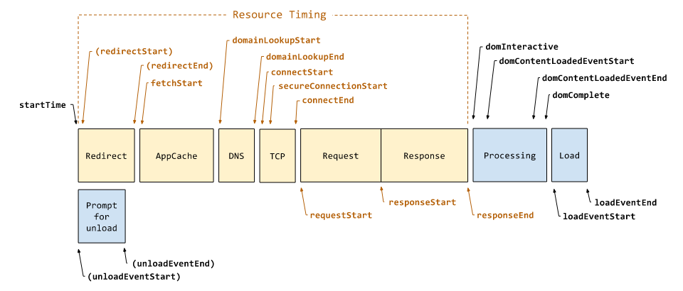

:::tip 原文链接
[W3C](https://w3c.github.io/navigation-timing/#dom-performancenavigationtiming)
:::

## 浏览器页面导航事件图


## Navigation Timing Level 1 (已过时)

```text
[Exposed=Window]
interface PerformanceTiming {
  readonly attribute unsigned long long navigationStart;
  readonly attribute unsigned long long unloadEventStart;
  readonly attribute unsigned long long unloadEventEnd;
  readonly attribute unsigned long long redirectStart;
  readonly attribute unsigned long long redirectEnd;
  readonly attribute unsigned long long fetchStart;
  readonly attribute unsigned long long domainLookupStart;
  readonly attribute unsigned long long domainLookupEnd;
  readonly attribute unsigned long long connectStart;
  readonly attribute unsigned long long connectEnd;
  readonly attribute unsigned long long secureConnectionStart;
  readonly attribute unsigned long long requestStart;
  readonly attribute unsigned long long responseStart;
  readonly attribute unsigned long long responseEnd;
  readonly attribute unsigned long long domLoading;
  readonly attribute unsigned long long domInteractive;
  readonly attribute unsigned long long domContentLoadedEventStart;
  readonly attribute unsigned long long domContentLoadedEventEnd;
  readonly attribute unsigned long long domComplete;
  readonly attribute unsigned long long loadEventStart;
  readonly attribute unsigned long long loadEventEnd;
  [Default] object toJSON();
};
```


### navigationStart
该属性将在卸载前一个页面后立即返回时间。如果是在空白页面打开的，则返回当前页面的创建时间  


### unloadEventStart
如果前一个页面和当前页面同源，则返回前一个页面卸载事件开始的时间；如果没有前一个页面，或者
两个页面不同源，则返回 `0`  

### unloadEventEnd
如果前一个页面和当前页面同源，则返回前一个页面卸载事件结束的时间；如果没有前一个页面，或者
两个页面不同源，或者前一个页面的卸载事件还未结束，则返回 `0`

如果导航时存在`HTTP重定向`，且**不是**所有的重定向都是同源的，则` PerformanceTiming.unloadEventStart `和`PerformanceTiming.unloadEventEnd` 都返回 `0`


### redirectStart
如果导航时存在`HTTP重定向`，且**所有**的重定向都是同源的，则此属性返回获取(`fetch`)重定向开始的时间，否则返回`0`


### redirectEnd
如果导航时存在`HTTP重定向`，且**所有**的重定向都是同源的，则返回接收到最后一个重定向请求的最后一个字节的时间，否则返回`0`


### fetchStart
如果指向的新的页面资源需要使用`GET`请求去获取的话，这个属性将返回浏览器开始检查缓存(也就是检查浏览器缓存)是否命中的时间
，否则，返回浏览器发起请求的开始时间。


### domainLookupStart
该属性返回浏览器开始进行DNS解析的时间。如果命中了缓存（非DNS缓存），或者是长连接，则返回和`fetchStart`一样的时间

### domainLookupEnd
该属性返回浏览器结束DNS解析的时间。如果命中了缓存(非DNS缓存)，或者是长连接，则返回和`fetchStart`一样的时间

:::tip
如果浏览器从各种缓存中取到了DNS信息(浏览器本身的缓存、操作系统缓存、hosts文件等), 则上述两个属性表示了
浏览器开始读取缓存以及读取结束的时间
:::

### connectStart
该属性返回浏览器建立连接的开始时间，如果命中了缓存(浏览器缓存)，或者是长连接，则返回和`domainLookupEnd`一样的时间

### connectEnd
该属性返回浏览器建立连接的结束时间，如果命中了缓存(浏览器缓存)，或者是长连接，则返回和`domainLookupEnd`一样的时间

如果连接建立失败，并且浏览器重发了连接请求，`PerformanceTiming.connectStart` 和 `PerformanceTiming.connectEnd`
返回新连接对应的值

`PerformanceTiming.connectEnd`包括建立传输连接的时间以及其他时间，如`SSL`握手时间以及`SOCKS`身份验证时间


### secureConnectionStart
该属性时可选的。如果当前页面是`HTTPS`安全连接， 则返回浏览器开始`HTTPS`握手的时间，否则返回`0`

### requestStart
此属性必须返回浏览器开始从服务器、缓存或本地资源请求当前文档的时间。

如果在发送请求后传输连接失败，并且浏览器重新建立连接并重发了请求， `PerformanceTiming.requestStart`应该返回新请求的相应值。


### responseStart
此属性返回浏览器从服务器、缓存或本地资源接收到响应的第一个字节后的时间。

### responseEnd
此属性返回的是，浏览器接收到当前文档的最后一个字节的时间，或者传输连接关闭的时间，取两者中的较小值。

### domLoading
返回浏览器将当前文档状态设置成`loading`的时间点


### domInteractive
返回浏览器将当前文档状态设置成`interactive`（可交互）的时间点

### domContentLoadedEventStart
返回浏览器触发`DOMContentLoaded`事件执行的时间点

### domContentLoadedEventEnd
返回`DOMContentLoaded`事件执行完成的时间点

### domComplete
返回浏览器将当前文档状态设置成`complete`的时间点

### loadEventStart
返回浏览器触发`onload`事件执行的时间点，否则为0

### loadEventEnd
返回`onload`事件执行完成的时间点

:::tip
浏览器加载转圈结束的时间点为`loadEventEnd`
:::


## Navigation Timing Level 2
TBD
