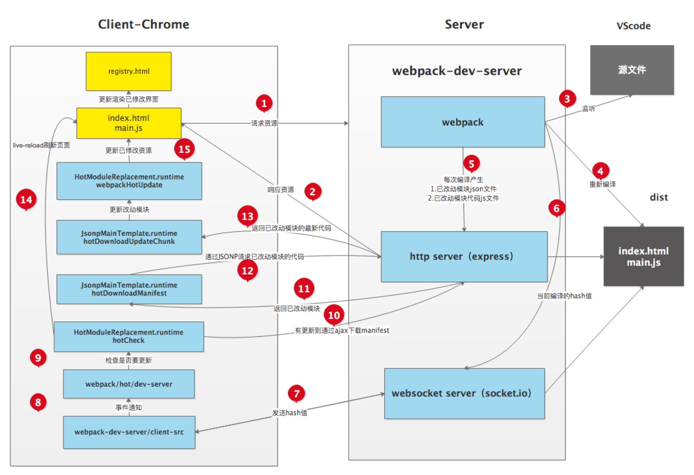

:::tip
[参考文章](https://github.com/careteenL/webpack-hmr) 在原文基础上有删改
:::

[[toc]]

## HMR是什么

`HMR`即`热模块重载、热模块替换(Hot Module Replacement)`是指当你对代码修改并保存后，`webpack`将会对代码进行重新打包，并将改动的模块发送到浏览器端，浏览器用新的模块**替换**掉旧的模块，去实现局部更新页面而非整体刷新页面。

### 使用场景

一个注册页面包含`用户名`、`密码`、`邮箱`三个必填输入框，以及一个`提交`按钮，
当你在调试`邮箱`模块并改动了代码时，没做任何处理情况下会刷新整个页面，频繁的改动代码会浪费你大量时间去重新填写内容。  
预期是保留`用户名`、`密码`的输入内容，而只替换`邮箱`这一模块。这一诉求就需要借助`webpack-dev-server`的热模块更新功能。  

相对于`live reload`整体刷新页面的方案，`HMR`的优点在于可以保存应用的状态，提高开发效率。

## 在Webpack中使用HMR

### 配置webpack

首先借助`webpack`搭建项目

- 初识化项目并导入依赖
```shell
mkdir webpack-hmr && cd webpack-hmr
npm i -y
npm i -S webpack webpack-cli webpack-dev-server html-webpack-plugin
```

- 配置文件`webpack.config.js`
```js
const path = require('path')
const webpack = require('webpack')
const htmlWebpackPlugin = require('html-webpack-plugin')

module.exports = {
  mode: 'development', // 开发模式不压缩代码，方便调试
  entry: './src/index.js', // 入口文件
  output: {
    path: path.join(__dirname, 'dist'),
    filename: 'main.js'
  },
  devServer: {
    contentBase: path.join(__dirname, 'dist')
  },
  plugins: [
    new htmlWebpackPlugin({
      template: './src/index.html',
      filename: 'index.html'
    })
  ]
}
```

- 新建`src/index.js`入口文件编写简单逻辑
```js
var root = document.getElementById('root')
function render () {
  root.innerHTML = require('./content.js')
}
render();
```

- 新建依赖文件`src/content.js`导出字符供index渲染页面
```js
var ret = 'Hello Webpack Hot Module Replacement'
module.exports = ret
// export default ret
```

- 配置`package.json`
```json
  "scripts" :{
    "dev": "webpack-dev-server",
    "build": "webpack"
  }
```

- 然后`npm run dev`即可启动项目

- 通过`npm run build`打包生成静态资源到`dist`目录


### 解析Webpack打包后的文件内容('./dist')

- Webpack自己实现的一套CommonJs规范讲解

dist目录结构
```shell
.
├── index.html
└── main.js
```
#### 其中`index.html`内容如下
```html
<!-- ... -->
<div id="root"></div>
<script type="text/javascript" src="main.js"></script></body>
<!-- ... -->
```
使用`html-webpack-plugin`插件将入口文件及其依赖通过`script`标签引入

#### 先对`main.js`内容去掉注释和无关内容进行分析
```js
(() => { // webpackBootStrap 一个巨大的自执行函数
   // 依赖的模块对象 可能会很巨大  
  // 键为入口文件或依赖文件相对于根目录的相对路径，值则是另一个自执行函数执行后的结果，其中使用`eval`执行文件的内容字符。  
  var __webpack_modules__ = {
    "./src/content.js":
    (function (module, exports) {
      eval("var ret = 'Hello Webpack Hot Module Replacement'\n\nmodule.exports = ret\n// export default ret\n\n");
    }),
            // 代码中的require变成了 __webpack_require__ 自定义函数
    "./src/index.js": (function (module, exports, __webpack_require__) {
    eval("var root = document.getElementById('root')\nfunction render () {\n  root.innerHTML = __webpack_require__(/*! ./content.js */ \"./src/content.js\")\n}\nrender()\n\n\n");
  })
  }
  // ....
})
```
- 接下来是核心的__webpack_require__ 函数
```js
(() => {
    // ...__webpack_modules__ ...
    function __webpack_require__() {
      // 检查模块是否在缓存中
		var cachedModule = __webpack_module_cache__[moduleId];
 		if (cachedModule !== undefined) {
 			if (cachedModule.error !== undefined) throw cachedModule.error;
 			return cachedModule.exports;
 		}
 		// 创建一个module 并且放入缓存中
 		var module = __webpack_module_cache__[moduleId] = {
 			id: moduleId,
 			loaded: false, // 标识是否加载
 			exports: {}
 		};
    // 执行模块函数
      /**
       *  module: 传入的module对象
       *  moduleId: 如 '/src/index.js'
       * */
    // 执行模块函数
    try {
      var execOptions = { id: moduleId, module: module, factory: __webpack_modules__[moduleId], require: __webpack_require__ };
      __webpack_require__.i.forEach(function(handler) { handler(execOptions); });
      module = execOptions.module;
      execOptions.factory.call(module.exports, module, module.exports, execOptions.require);
      } catch(e) {
       module.error = e;
       throw e;
    }
    // 标识该模块已经被加载
    module.loaded = true;
    // 返回模块的exports
    return module.exports;
  }
  // 暴露模块对象 (__webpack_modules__)
  	__webpack_require__.m = __webpack_modules__;
 // 暴露模块缓存
    __webpack_require__.c = __webpack_module_cache__;
 // 暴露模块执行拦截器
    __webpack_require__.i = [];
  
  // ...
  // 加载入口文件
  return __webpack_require__(__webpack_require__.s = "./src/index.js")
})
```

### 配置HMR

接下来配置并感受一下热更新带来的便捷开发

`webpack.config.js`配置
```js
  // ...
  devServer: {
    hot: true
  }
  // ...
```

`./src/index.js`配置
```js
// ...
if (module.hot) {
  module.hot.accept(['./content.js'], () => {
    render()
  })
}
```
当更改`./content.js`的内容并保存时，可以看到页面没有刷新，但是内容已经被替换了。

## HMR原理

如上图所示，右侧`Server`端使用`webpack-dev-server`去启动本地服务，内部实现主要使用了`webpack`、`express`、`websocket`。

- 使用`express`启动本地HTTP服务，响应浏览器访问资源的请求
- 服务端和客户端使用`websocket`实现长连接
- `webpack`监听源文件的变化，即当开发者保存文件时触发`webpack`的重新编译。
    - 每次编译都会生成`hash值`、`已改动模块的json文件`、`已改动模块代码的js文件`
    - 编译完成后通过`websocket`向客户端推送当前编译的`hash戳`
- 客户端的`websocket`监听到有文件改动推送过来的`hash戳`，会和上一次（缓存的）对比
    - 一致则走缓存
    - 不一致则通过`ajax`和`jsonp`向服务端获取最新资源
- 使用`内存文件系统(memory file system)`去替换有修改的内容实现局部刷新


## 服务端实现细节

下面步骤主要是debug服务端源码分析其详细思路，也给出了代码所处的具体位置，感兴趣的可以先行定位到下面的代码处设置断点，然后观察数据的变化情况。也可以先跳过阅读此步骤。**

1. 启动`webpack-dev-server`服务器，源代码地址[@webpack-dev-server/webpack-dev-server.js#L173](https://github.com/webpack/webpack-dev-server/blob/v3.7.2/bin/webpack-dev-server.js#L173)
2. 创建webpack实例，源代码地址[@webpack-dev-server/webpack-dev-server.js#L89](https://github.com/webpack/webpack-dev-server/blob/v3.7.2/bin/webpack-dev-server.js#L89)
3. 创建Server服务器，源代码地址[@webpack-dev-server/webpack-dev-server.js#L107](https://github.com/webpack/webpack-dev-server/blob/v3.7.2/bin/webpack-dev-server.js#L107)
4. 添加webpack的done事件回调，源代码地址[@webpack-dev-server/Server.js#L122](https://github.com/webpack/webpack-dev-server/blob/v3.7.2/lib/Server.js#L122)
5. 编译完成向客户端发送消息，源代码地址[@webpack-dev-server/Server.js#L184](https://github.com/webpack/webpack-dev-server/blob/v3.7.2/lib/Server.js#L184)
6. 创建express应用app，源代码地址[@webpack-dev-server/Server.js#L123](https://github.com/webpack/webpack-dev-server/blob/v3.7.2/lib/Server.js#L123)
7. 设置文件系统为内存文件系统，源代码地址[@webpack-dev-middleware/fs.js#L115](https://github.com/webpack/webpack-dev-middleware/blob/v3.7.0/lib/fs.js#L115)
8. 添加webpack-dev-middleware中间件，源代码地址[@webpack-dev-server/Server.js#L125](https://github.com/webpack/webpack-dev-server/blob/v3.7.2/lib/Server.js#L125)
9. 中间件负责返回生成的文件，源代码地址[@webpack-dev-middleware/middleware.js#L20](https://github.com/webpack/webpack-dev-middleware/blob/v3.7.0/lib/middleware.js#L20)
10. 启动webpack编译，源代码地址[@webpack-dev-middleware/index.js#L51](https://github.com/webpack/webpack-dev-middleware/blob/v3.7.0/index.js#L51)
11. 创建http服务器并启动服务，源代码地址[@webpack-dev-server/Server.js#L135](https://github.com/webpack/webpack-dev-server/blob/v3.7.2/lib/Server.js#L135)
12. 使用sockjs在浏览器端和服务端之间建立一个 websocket 长连接，源代码地址[@webpack-dev-server/Server.js#L745](https://github.com/webpack/webpack-dev-server/blob/v3.7.2/lib/Server.js#L745)
13. 创建socket服务器，源代码地址[@webpack-dev-server/SockJSServer.js#L34](https://github.com/webpack/webpack-dev-server/blob/v3.7.2/lib/servers/SockJSServer.js#L34)

### 服务端简易实现

#### 启动webpack-dev-server服务器
先导入所有依赖
```js
const path = require('path') // 解析文件路径
const express = require('express') // 启动本地服务
const mime = require('mime') // 获取文件类型 实现一个静态服务器
const webpack = require('webpack') // 读取配置文件进行打包
const MemoryFileSystem = require('memory-fs') // 使用内存文件系统更快，文件生成在内存中而非真实文件
const config = require('./webpack.config') // 获取webpack配置文件
```

#### 创建webpack实例
```js
const compiler = webpack(config);
```
compiler代表整个webpack编译任务，全局只有一个

#### 创建Server服务器
```js
class Server {
  constructor(compiler) {
    this.compiler = compiler
  }
  listen(port) {
    this.server.listen(port, () => {
      console.log(`服务器已经在${port}端口上启动了`)
    })
  }
}
let server = new Server(compiler);
server.listen(8000);
```
实际中是使用express作为HTTP服务器的

#### 添加webpack的done事件回调

```js
  constructor(compiler) {
    let sockets = []
    let lasthash
    compiler.hooks.done.tap('webpack-dev-server', (stats) => {
      lasthash = stats.hash
      // 每当新一个编译完成后都会向客户端发送消息
      sockets.forEach(socket => {
        socket.emit('hash', stats.hash) // 先向客户端发送最新的hash值
        socket.emit('ok') // 再向客户端发送一个ok
      })
    })
  }
```
`webpack`编译后提供提供了一系列钩子函数，以供插件能访问到它的各个生命周期节点，并对其打包内容做修改。`compiler.hooks.done`则是插件能修改其内容的最后一个节点。

编译完成通过`socket`向客户端发送消息，推送每次编译产生的`hash`。另外如果是热更新的话，还会产出两个补丁文件，里面描述了从上一次结果到这一次结果都有哪些chunk和模块发生了变化。

使用`let sockets = []`数组去存放当打开了多个Tab时每个Tab的`socket实例`。

#### 创建express应用app
```js
let app = new express()
```

#### 设置文件系统为内存文件系统
```js
let fs = new MemoryFileSystem()
```
使用`MemoryFileSystem`将`compiler`的产出文件打包到内存中。

#### 添加webpack-dev-middleware中间件
```js
  function middleware(req, res, next) {
    if (req.url === '/favicon.ico') {
      return res.sendStatus(404)
    }
    // /index.html   dist/index.html
    let filename = path.join(config.output.path, req.url.slice(1))
    let stat = fs.statSync(filename)
    if (stat.isFile()) { // 判断是否存在这个文件,如果在的话直接把这个读出来发给浏览器
      let content = fs.readFileSync(filename)
      let contentType = mime.getType(filename)
      res.setHeader('Content-Type', contentType)
      res.statusCode = res.statusCode || 200
      res.send(content)
    } else {
      return res.sendStatus(404)
    }
  }
  app.use(middleware)
```
使用express启动了本地开发服务后，使用了内存文件系统，使读取文件后存放到内存中，提高读写效率，最终返回生成的文件。

#### 启动webpack编译
```js
  compiler.watch({}, err => {
    console.log('又一次编译任务成功完成了')
  })
```
以监控的模式启动一次webpack编译，当编译成功之后执行回调

#### 创建HTTP服务器并启动服务

```js
  constructor(compiler) {
    // ...
    this.server = require('http').createServer(app);
    // ...
  }
  listen(port) {
    this.server.listen(port, () => {
      console.log(`服务器已经在${port}端口上启动了`);
    })
  }
```
#### 使用sockjs在浏览器端和服务端之间建立一个 websocket 长连接
```js
  constructor(compiler) {
    // ...
    this.server = require('http').createServer(app)
    let io = require('socket.io')(this.server)
    io.on('connection', (socket) => {
      sockets.push(socket)
      socket.emit('hash', lastHash)
      socket.emit('ok')
    })
  }
```
启动一个 websocket服务器，然后等待连接，连接到来之后存进sockets池;

当有文件改动，webpack重新编译时，向客户端推送`hash`和`ok`两个事件
。


## 客户端实现细节

下面步骤主要是debug客户端源码分析其详细思路，也给出了代码所处的具体位置，感兴趣的可以先行定位到下面的代码处设置断点，然后观察数据的变化情况。也可以先跳过阅读此步骤。

1. webpack-dev-server/client端会监听到此hash消息，源代码地址[@webpack-dev-server/index.js#L54](https://github.com/webpack/webpack-dev-server/blob/v3.7.2/client-src/default/index.js#L54)
2. 客户端收到ok的消息后会执行reloadApp方法进行更新，源代码地址[index.js#L101](https://github.com/webpack/webpack-dev-server/blob/v3.7.2/client-src/default/index.js#L101)
3. 在reloadApp中会进行判断，是否支持热更新，如果支持的话发射webpackHotUpdate事件，如果不支持则直接刷新浏览器，源代码地址[reloadApp.js#L7](https://github.com/webpack/webpack-dev-server/blob/v3.7.2/client-src/default/utils/reloadApp.js#L7)
4. 在webpack/hot/dev-server.js会监听webpackHotUpdate事件，源代码地址[dev-server.js#L55](https://github.com/webpack/webpack/blob/v4.39.1/hot/dev-server.js#L55)
5. 在check方法里会调用module.hot.check方法，源代码地址[dev-server.js#L13](https://github.com/webpack/webpack/blob/v4.39.1/hot/dev-server.js#L13)
6. HotModuleReplacement.runtime请求Manifest，源代码地址[HotModuleReplacement.runtime.js#L180](https://github.com/webpack/webpack/blob/v4.39.1/lib/HotModuleReplacement.runtime.js#L180)
7. 它通过调用 JsonpMainTemplate.runtime的hotDownloadManifest方法，源代码地址[JsonpMainTemplate.runtime.js#L23](https://github.com/webpack/webpack/blob/v4.39.1/lib/web/JsonpMainTemplate.runtime.js#L23)
8. 调用JsonpMainTemplate.runtime的hotDownloadUpdateChunk方法通过JSONP请求获取到最新的模块代码，源代码地址[JsonpMainTemplate.runtime.js#L14](https://github.com/webpack/webpack/blob/v4.39.1/lib/web/JsonpMainTemplate.runtime.js#L14)
9. 补丁JS取回来后会调用JsonpMainTemplate.runtime.js的webpackHotUpdate方法，源代码地址[JsonpMainTemplate.runtime.js#L8](https://github.com/webpack/webpack/blob/v4.39.1/lib/web/JsonpMainTemplate.runtime.js#L8)
10. 然后会调用HotModuleReplacement.runtime.js的hotAddUpdateChunk方法动态更新模块代码，源代码地址[HotModuleReplacement.runtime.js#L222](https://github.com/webpack/webpack/blob/v4.39.1/lib/HotModuleReplacement.runtime.js#L222)
11. 然后调用hotApply方法进行热更新，源代码地址[HotModuleReplacement.runtime.js#L257](https://github.com/webpack/webpack/blob/v4.39.1/lib/HotModuleReplacement.runtime.js#L257)、[HotModuleReplacement.runtime.js#L278](https://github.com/webpack/webpack/blob/v4.39.1/lib/HotModuleReplacement.runtime.js#L278)

### 客户端简易实现

#### webpack-dev-server/client端会监听到此hash消息
在开发客户端功能之前，需要在`src/index.html`中引入`socket.io`
```html
<script src="/socket.io/socket.io.js"></script>
```
下面连接socket并接受消息
```js
let socket = io('/')
socket.on('connect', onConnected)
const onConnected = () => {
  console.log('客户端连接成功')
}
let hotCurrentHash; // lastHash 上一次 hash值 
let currentHash; // 这一次的hash值
socket.on('hash', (hash) => {
  currentHash = hash;
})
```
将服务端webpack每次编译所产生`hash`进行缓存

#### 客户端收到ok的消息后会执行reloadApp方法进行更新
```js
socket.on('ok', () => {
  reloadApp(true)
})
```
#### reloadApp中判断是否支持热更新
```js
// 当收到ok事件后，会重新刷新app
function reloadApp(hot) {
  if (hot) { // 如果hot为true 走热更新的逻辑
    hotEmitter.emit('webpackHotUpdate')
  } else { // 如果不支持热更新，则直接重新加载
    window.location.reload()
  }
}
```
在reloadApp中会进行判断，是否支持热更新，如果支持的话发射(emit)webpackHotUpdate事件，如果不支持则直接刷新浏览器。
#### 在webpack/hot/dev-server.js会监听webpackHotUpdate事件

首先需要一个发布订阅去绑定事件并在合适的时机触发。
```js
class Emitter {
  constructor() {
    this.listeners = {}
  }
  on(type, listener) {
    this.listeners[type] = listener
  }
  emit(type) {
    this.listeners[type] && this.listeners[type]()
  }
}
let hotEmitter = new Emitter()
hotEmitter.on('webpackHotUpdate', () => {
  if (!hotCurrentHash || hotCurrentHash == currentHash) {
    return hotCurrentHash = currentHash
  }
  hotCheck()
})
```
会判断是否为第一次进入页面和代码是否有更新。

#### 在check方法里会调用module.hot.check方法
```js
function hotCheck() {
  hotDownloadManifest().then(update => {
    let chunkIds = Object.keys(update.c)
    chunkIds.forEach(chunkId => {
      hotDownloadUpdateChunk(chunkId)
    })
  })
}
```
上面也提到过webpack每次编译都会产生`hash值`、`已改动模块的json文件`、`已改动模块代码的js文件`，

此时先使用`ajax`请求`Manifest`即服务器这一次编译相对于上一次编译改变了哪些module和chunk。

然后再通过`jsonp`获取这些已改动的module和chunk的代码。

#### 调用hotDownloadManifest方法
```js
function hotDownloadManifest() {
  return new Promise(function (resolve) {
    let request = new XMLHttpRequest()
    //hot-update.json文件里存放着从上一次编译到这一次编译 取到差异
    let requestPath = '/' + hotCurrentHash + ".hot-update.json"
    request.open('GET', requestPath, true)
    request.onreadystatechange = function () {
      if (request.readyState === 4) {
        let update = JSON.parse(request.responseText)
        resolve(update)
      }
    }
    request.send()
  })
}
```

#### 调用hotDownloadUpdateChunk方法通过JSONP请求获取到最新的模块代码
```js
function hotDownloadUpdateChunk(chunkId) {
  let script = document.createElement('script')
  script.charset = 'utf-8'
  // /main.xxxx.hot-update.js
  script.src = '/' + chunkId + "." + hotCurrentHash + ".hot-update.js"
  document.head.appendChild(script)
}
```
这里解释下为什么使用`JSONP`获取而不直接利用`socket`获取最新代码？主要是因为`JSONP`获取的代码可以直接执行。

#### 调用webpackHotUpdate方法
当客户端把最新的代码拉到浏览之后

```js
window.webpackHotUpdate = function (chunkId, moreModules) {
  // 循环新拉来的模块
  for (let moduleId in moreModules) {
    // 从模块缓存中取到老的模块定义
    let oldModule = __webpack_require__.c[moduleId]
    // parents哪些模块引用这个模块 children这个模块引用了哪些模块
    // parents=['./src/index.js']
    let {
      parents,
      children
    } = oldModule
    // 更新缓存为最新代码 缓存进行更新
    let module = __webpack_require__.c[moduleId] = {
      i: moduleId,
      l: false,
      exports: {},
      parents,
      children,
      hot: window.hotCreateModule(moduleId)
    }
    moreModules[moduleId].call(module.exports, module, module.exports, __webpack_require__)
    module.l = true // 状态变为加载就是给module.exports 赋值了
    parents.forEach(parent => {
      // parents=['./src/index.js']
      let parentModule = __webpack_require__.c[parent]
      // _acceptedDependencies={'./src/title.js',render}
      parentModule && parentModule.hot && parentModule.hot._acceptedDependencies[moduleId] && parentModule.hot._acceptedDependencies[moduleId]()
    })
    hotCurrentHash = currentHash
  }
}
```

#### hotCreateModule的实现

实现我们可以在业务代码中定义需要热更新的模块以及回调函数，将其存放在`hot._acceptedDependencies`中。
```js
window.hotCreateModule = function () {
  let hot = {
    _acceptedDependencies: {},
    dispose() {
      // 销毁老的元素
    },
    accept: function (deps, callback) {
      for (let i = 0; i < deps.length; i++) {
        // hot._acceptedDependencies={'./title': render}
        hot._acceptedDependencies[deps[i]] = callback
      }
    }
  }
  return hot
}
```

然后在`webpackHotUpdate`中进行调用
```js
    parents.forEach(parent => {
      // parents=['./src/index.js']
      let parentModule = __webpack_require__.c[parent]
      // _acceptedDependencies={'./src/title.js',render}
      parentModule && parentModule.hot && parentModule.hot._acceptedDependencies[moduleId] && parentModule.hot._acceptedDependencies[moduleId]()
    })
```
最后调用hotApply方法进行热更新

## Vite中的HMR
以下内容引用自Vite官网
>基于打包器启动时，重建整个包的效率很低。原因显而易见：因为这样更新速度会随着应用体积增长而直线下降。  
<br/>
>一些打包器的开发服务器将构建内容存入内存，这样它们只需要在文件更改时使模块图的一部分失活，但它也仍需要整个重新构建并重载页面。这样代价很高，并且重新加载页面会消除应用的当前状态，所以打包器支持了动态模块热重载（HMR）：允许一个模块 “热替换” 它自己，而不会影响页面其余部分。这大大改进了开发体验 —— 然而，在实践中我们发现，即使采用了 HMR 模式，其热更新速度也会随着应用规模的增长而显著下降。  
<br/>
>在 Vite 中，HMR 是在原生 ESM 上执行的。当编辑一个文件时，Vite 只需要精确地使已编辑的模块与其最近的 HMR 边界之间的链失活（大多数时候只是模块本身），使得无论应用大小如何，HMR 始终能保持快速更新。  
<br/>
>Vite 同时利用 HTTP 头来加速整个页面的重新加载（再次让浏览器为我们做更多事情）：源码模块的请求会根据 304 Not Modified 进行协商缓存，而依赖模块请求则会通过 Cache-Control: max-age=31536000,immutable 进行强缓存，因此一旦被缓存它们将不需要再次请求。  


## 问题
- webpack实现流程以及各个生命周期的作用是什么？
> webpack主要借助了`tapable`这个库所提供的一系列同步/异步钩子函数贯穿整个生命周期。

- 为什么使用JSONP而不用socket通信获取更新过的代码？
> 因为通过socket通信获取的是一串字符串需要再做处理。而通过`JSONP`获取的代码可以直接执行。

