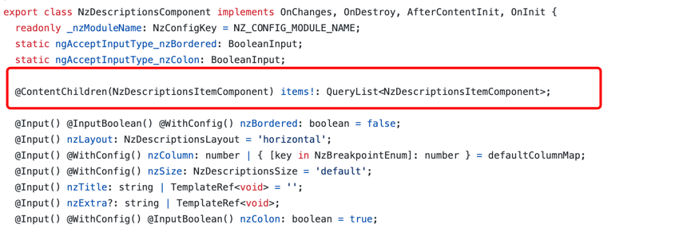
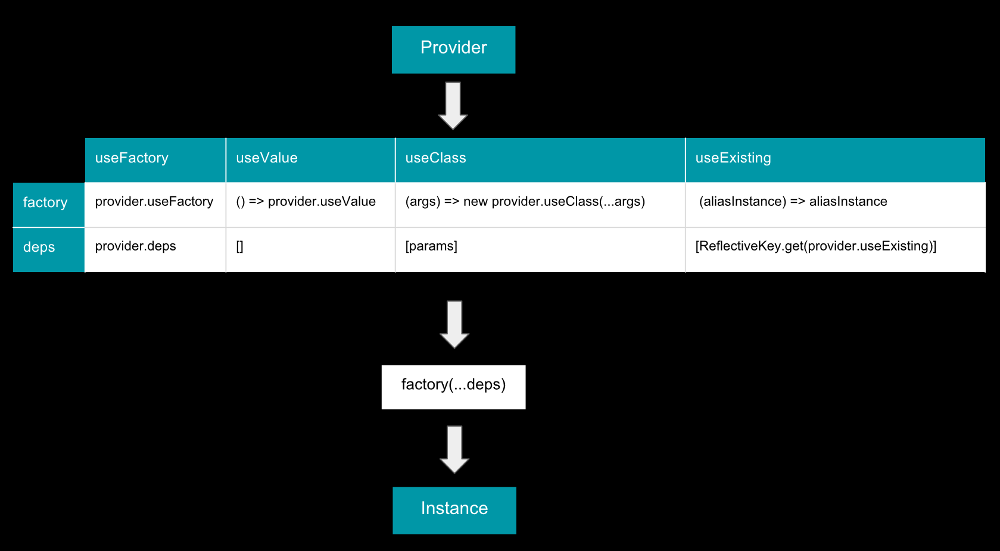

### 起因

项目中使用ng-zorro Antd的`Description`进行一个列表的展示，现在需要为其中某几个字段添加隐藏展示功能。  
隐藏时使用***展示 点击后进行相关验证后再展示真实数据。

**方案一**
在组件中添加n个变量 来控制对应字段的隐藏和展示。=> 可扩展性极差

**方案二**
在`<nz-description-item>`的基础上进行封装，生成`<private-description-item>`组件，内部维护一套状态 => 良好的解决问题

### 遇到问题

在`<nz-description>`组件中添加自己的`<private-description-item>`组件，不会显示。
原因分析：在`nz-description`组件中, Antd使用了`@ContentChildren`来接收要渲染的子组件。如下图：


`@ContentChildren(NzDescriptionsItemComponent)`指定了可以被渲染的子组件仅限于`NzDescriptionsItemComponent`类型  
不接受其他任何组件，本质上`@ContentChildren`是从内容投影中选择了一部分要渲染的内容。

那是不是就没有办法了呢？经过我的查找，找到了对应的解决方法。如下代码所示

```typescript
import { Component, forwardRef, Input, OnInit } from '@angular/core';
import { NzDescriptionsItemComponent } from 'ng-zorro-antd/descriptions';

@Component({
  selector: 'app-private-description-item',
  template: `
    <ng-template>
         // 供父组件读取的内容
         <ng-content *ngIf='visible'></ng-content>
         // 此处可以自由定义需要的样式
         <div *ngIf='!visible' (click)='visible = true'>*******</div>
    </ng-template> 
  `,
  styleUrls: ['./private-description-item.component.scss'],
  providers: [
      {
          provide: NzDescriptionsItemComponent,
          useExisting: forwardRef(() => PrivateDescriptionItemComponent)
      }
  ]
})
export class PrivateDescriptionItemComponent extends NzDescriptionsItemComponent implements OnInit {

  @Input() title: any;

  visible = false; // 控制展示与隐藏

  @Input() nzTitle: string;

  @Input() nzSpan: number;

  constructor() {
      super();
  }

  ngOnInit(): void {
  }
}
```
核心点：
1. 组件继承`NzDescriptionsItemComponent`，包含需要被父组件读取的属性`nzTitle`, `nzSpan`等
2. 指定`providers`属性，其中对外暴露`NzDescriptionsItemComponent`, 并指定`Angular`使用已存在的值：
`useExist(forwardRef(() => PrivateDescriptionItemComponent))`对外转发当前组件。

### useClass与useExist的区别
先看一张来自stackOverFlow的图片：


四种类型的`provider`本质上都是经过一个工厂函数（`factory`）转化而来，`useClass`从参数中解析依赖然后创建一个新的类实例，
而`useExist`返回目前已有的类实例（可以看作是创建了一个引用）  

### useExist中的forwardRef
```typescript
// Angular 源码
export function resolveForwardRef(type: any): any {
  if (typeof type === 'function' && type.hasOwnProperty('__forward_ref__') &&
      type.__forward_ref__ === forwardRef) {
    return (<ForwardRefFn>type)();
  } else {
    return type;
  }
}
```
使用`forwardRef`包裹后，允许引用指向一个尚未被定义的实例（在本例中就是`PrivateDescriptionItemComponent`组件，其尚未被实例化）
>For instance, forwardRef is used when the token which we need to refer to for the purposes of DI is declared, 
> but not yet defined. It is also used when the token which we use when creating a query is not yet defined

实现原理：闭包


### 参考文章
1. [stackOverFlow](https://stackoverflow.com/questions/49278479/contentchildren-with-multiple-content-types)
2. [官方文档](https://angular.cn/guide/dependency-injection-providers)
3. [Angular Dependency Injection](https://chgc.gitbooks.io/another-book-about-angular/content/chapter11/di.html)
4. [indepth.dev](https://indepth.dev/posts/1133/what-is-forwardref-in-angular-and-why-we-need-it)
5. [offering.solutions](https://offering.solutions/blog/articles/2018/08/17/using-useclass-usefactory-usevalue-useexisting-with-treeshakeable-providers-in-angular/)
