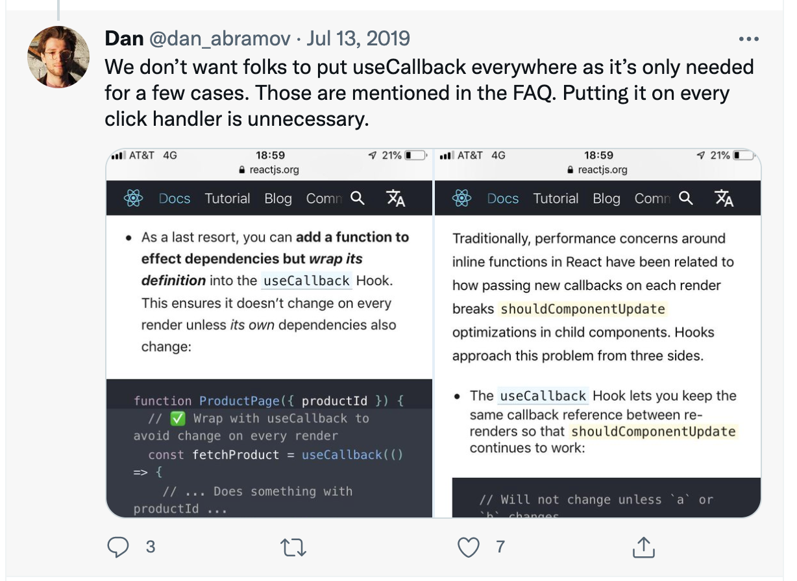

[[toc]]

### 从re-render说起

我们知道在 React 中，页面的变化来自组件的重新渲染，重新渲染对于类组件来说就是调用内部的`render`方法，
对于函数式组件来说就是重新执行这个函数。不管如何，最后的结果就是拿到返回的结果重新生成`Virtual DOM Tree`，
然后经过一系列比如`diff`、`patch`等操作后，完成一次更新。

一个组件在三种情况下会触发`重新渲染`，也就是`re-render`：
1. 组件本身的 state 发生变化时(调用`this.setState`/`useState`)。
2. 组件的 props 中任意一个属性的值发生改变时。
3. 组件的父组件触发`re-render`时。

>注意，当子组件以 props.children 属性引入时，不会因为第三条规则而触发 re-render， 如下所示
```jsx
import { useState } from "react";

export default function App() {
    return (
        <ColorPicker>
            <p>Hello, world!</p>
            <ExpensiveTree />
        </ColorPicker>
    );
}

function ColorPicker({ children }) {
    console.log("color re-render"); // 每次都会触发
    let [color, setColor] = useState("red");
    return (
        <div style={{ color }}>
            <input value={color} onChange={(e) => setColor(e.target.value)} />
            {children}
        </div>
    );
}

function ExpensiveTree() {
    console.log("re-render"); // 只会触发一次
    let now = performance.now();
    while (performance.now() - now < 100) {
        // Artificial delay -- do nothing for 100ms
    }
    return <p>I am a very slow component tree.</p>;
}
```
前两条是正常的更新路径，而第三条就会存在一些问题。

让我们假设一个父组件`ParentComp`的 state 发生了变化，这时会触发子组件`ChildComp`的重新渲染，
即使子组件的 props 和 state 都没有发送变化，也会经历`调用子组件render函数` -> `生成VDOM树`
-> `diff` -> `没有变化` -> `返回`这样的过程，这就为性能优化带来了一些空间。

### 在类组件中我们是怎么做的

在类组件中，我们有两种方法：  
第一种是继承`React.PureComponent`。
`pureComponent`中为我们默认实现了`shouldComponentUpdate`方法，在其中对`prevState`、`prevProps`
进行浅比较，如果发现都相等，则会阻断当前组件的`re-render`过程。 
一种可能的浅比较实现如下：  
```javascript
// 进行比较的函数
function is(x: mixed, y: mixed): boolean {
  if (x === y) { // Steps 1-5, 7-10
    // Steps 6.b-6.e: +0 != -0
    // Added the nonzero y check to make Flow happy, but it is redundant
    return x !== 0 || y !== 0 || 1 / x === 1 / y;
  } else {
    // Step 6.a: NaN == NaN
    return x !== x && y !== y;
  }
}

function shallowEqual(objA: mixed, objB: mixed): boolean {
  if (is(objA, objB)) {
    return true;
  }

  if (typeof objA !== 'object' || objA === null ||
      typeof objB !== 'object' || objB === null) {
    return false;
  }

  const keysA = Object.keys(objA);
  const keysB = Object.keys(objB);

  if (keysA.length !== keysB.length) {
    return false;
  }

  // 比较对象的每个键值是否相等
  for (let i = 0; i < keysA.length; i++) {
    if (
      !hasOwnProperty.call(objB, keysA[i]) ||
      !is(objA[keysA[i]], objB[keysA[i]])
    ) {
      return false;
    }
  }

  return true;
}

```
第二种方法则是自己实现`shouldComponentUpdate`方法，来阻断不必要的渲染。一个简单的例子：  
```javascript
function shouldComponentUpdate(nextProps, nextState) {
        if (this.props.count === nextProps.count) {
            return false;
        }
        return true;
}
```

### 存在的问题
从上面的比较函数中可以看出，对于深层的引用对象，只会简单的比较他们的引用是否相同，假设我们有一个组件继承自`PureComponent`，然后写下下面这样一段代码：  
```javascript
state = {
    list: []
};

clickBtn = () => {
  this.state.list.push({
    id: Math.random(),
    name: randomStr.generate(4)
  });
  this.setState(this.state);
};
```
你会发现组件并不会得到更新，这是因为`this.state.list`的引用并未发生过变化，浅比较返回`true`，
所以 React 认为这个组件并不需要更新。为什么会发生这种情况呢？本质上来说就是因为：

1. JS变量分为`基本类型变量`和`引用类型变量`
对于`number`,`string`,`boolean`,`undefined`,`null`这些基本类型变量，值存在栈中;
对于`object`,`Array`,`function`这些引用类型变量，引用存在栈中，而不同的引用却可以指向堆内存中的同一个对象。

2. 第二：JS中的对象是可变的`Mutable`（对象可以改变属性值，数组可以`push`、`pop`），但是对象的引用并不会发生变化，导致了性能优化失效。


### 解决方法
上面这个问题的解决方法有很多种，第一种就是生成一个新的引用：  
```javascript
clickBtn = () => {
  this.setState(prevState => {
      return {
          list: [
              ...prevState.list,
              {
                  id: Math.random(),
                  name: randomStr.generate(4)
              }
          ]
      }
  });
  // or
    this.setState({
        list: [
            ...this.state.list,
            { id: Math.random(), name: randomStr.genreate(4) }
        ]
    });  
}
```
解构之前的数组内容，并生成一个全新的数组，这样就会导致前后两次的引用发生了变化，可以触发更新。  

第二种就是使用`Object.assign`生成一个新的 state 。

第三种就是深拷贝或利用`JSON.parse(JSON.stringify(data))`，但无论哪种方法，本质都是生成一个新的引用，
能够通过浅比较正常更新。

### immutable & immutable.js

先让我们回到困扰我们的问题的根源 —— 两个引用类型变量的赋值表达式和两个基本类型变量的赋值表达式不同。
对于基本类型变量 `a` 和 `b`, 执行 b = a 后，访问 a ,b 相当于访问两个不同的变量，两者彼此毫无关联
```javascript
let a = 2, b;
b = a; //将a的值赋给b
a = 1; //改变a的值
console.log('a =' + a); //输出 a = 1
console.log('b =' + b); //输出 b = 2，表明赋值后b,a毫无关联
```
对于引用类型变量`obj1`和`obj2`，执行obj1 = obj2后，访问 obj1 和 obj2 相当于访问同一个变量，两者形成了一种“耦合”的关系。

```javascript
let obj1 ={ name:'judy' }, obj2;
obj2 = obj1; // 将obj1的地址赋给obj2
obj1.name = 'andy'; //改变obj1的name属性值
console.log('obj1.name =' + obj1.name); //输出 obj1.name = 'andy'
console.log('obj2.name =' + obj2.name); //输出 obj2.name = 'andy'，表明赋值后obj1/obj2形成耦合关系，两者互相影响
```

为什么基本类型和引用类型在变量赋值上面存在这么大的不同呢？
因为**基本类型变量占用的内存很小，而引用类型变量占用的内存比较大，
几个引用类型变量通过指针共享同一个变量可以节约内存**。

所以，在这个例子中，我们上面和下面所做的一切，都是在消除对象赋值表达式所带来的这一负面影响。  

那我们能不能通过一些方式，使得 obj2 = obj1 的时候，两变量指向的就是不同的两个对象呢？
社区早在我们之前就想到了 —— 这就是`immutable.js`，例子如下：  
```javascript
const { fromJS } = require('immutable')
let obj1 = fromJS({name:'judy'}), obj2;
obj2 = obj1; //obj2取得与obj1相同的值，但两个引用此时已经指向了不同的对象
obj2 = obj2.set('name','andy');//设置obj2的name属性值为andy
console.log('obj1.name =' + obj1.get('judy')); //obj1.name = judy
console.log('obj2.name =' + obj2.get('andy')); //obj2.name = andy
```
::: tip
1. 这个时候obj1 = obj2并不会使两者指向同一个堆内存中的对象，成功绕过了我们前面的所提到的对象赋值表达式所带来的坑。
我们就可以随心所欲的像使用普通基本类型变量复制 (a = b)那样对对象等引用类型赋值（obj1 = obj2）而不用拷贝新对象

2. 对于immutable对象，你不能再用obj.属性名那样取值了，你必须使用immutable.js提供的API

3. fromJS(obj)把传入的obj封装成immutable对象，在赋值给新对象时传递的只有本身的值而不是指向内存的地址。

4. obj.set(属性名，属性值)给obj增加或修改属性，但obj本身并不变化，只返回修改后的对象

5. obj.get(属性名)从immutable对象中取得属性值
:::

值得注意的是，immutable本身内部有一套机制，可以将这样深度拷贝带来的内存消耗的结果降至最小。
// TODO 


### 在函数式组件中我们是怎么做的
在函数式组件中，由于我们失去了类的实例，所以也就不存在使用生命周期钩子函数去优化的方法。  
`React.memo()`是React v16.6引进来的新属性。它的作用和`React.PureComponent`类似，
是用来控制函数组件的重新渲染的。`React.memo()` 其实就是函数组件的`React.PureComponent`。

一个简单的例子：  
```javascript
const Funcomponent = ()=> {
    return (
        <div>
            I am a Funtional component
        </div>
    )
}
const MemodFuncComponent = React.memo(FunComponent)
```
使用`React.memo`包裹后的组件，就拥有了和`PureComponent`一样的性能优化，但也存在和类组件相同的问题。

### 函数式组件的其他问题
我们来看下面的例子：  
```javascript
function Button(props) {
    const { handleClick, children } = props;
    console.log('Button render');

    return (
        <button onClick={handleClick}>{children}</button>
    )
}

const MemoizedButton = React.memo(Button);

function Index() {
    const [clickCount, increaseCount] = useState(0);
    
    const handleClick = () => {
        increaseCount(clickCount + 1);
    }

    return (
        <div>
            <p>{clickCount}</p>
            <MemoizedButton handleClick={handleClick}>Click</MemoizedButton>
        </div>
    )
}
```

即使使用了`React.memo`修饰了`Button`组件，但是每次点击`MemoizedButton`都会导致`MemoizedButton`组件重新渲染，因为：  
1. `Index`组件`state`发生变化，导致`Index`组件重新渲染
2. 每次渲染重新调用`Index()`, 导致重新创建内部函数`handleClick`
3. 传递给子组件的`props`中的`handleClick`函数的引用发生了变化
4. 进而导致子组件`MemoizedButton`也重新渲染。

使用`useCallback`进行优化：  
```javascript
function Button(props) {
    const { handleClick, children } = props;
    console.log('Button render');

    return (
        <button onClick={handleClick}>{children}</button>
    )
}

const MemoizedButton = React.memo(Button);

function Index() {
    const [clickCount, increaseCount] = useState(0);
    const handleClick = useCallback(() => {
        console.log('handleClick');
        increaseCount(clickCount + 1);
    }, [])

    return (
        <div>
            <p>{clickCount}</p>
            <MemoizedButton handleClick={handleClick}>Click</MemoizedButton>
        </div>
    )
}
```
使用`useCallback`包裹的函数，在`dependency`不发生变化的情况下，返回的函数总是同一份引用，就不会触发子组件的重渲染。 

### useCallback的问题
一个新的例子：  
```javascript
// 注意：Expensive 比较耗时记得使用`React.memo`优化下，要不然父组件优化也没用
const Expensive = React.memo(function (props) {
    console.log('Render Expensive')
    const { onClick } = props;
    const dateBegin = Date.now();
    // 模拟一个很重的组件
    while(Date.now() - dateBegin < 600) {}

    useEffect(() => {
        console.log('Render Expensive --- DONE')
    })

    return (
        <div onClick={onClick}>
            <p>很重的组件</p>
        </div>
    )
});

export default function Index() {
    const [text, updateText] = useState('Initial value');

    const handleSubmit = useCallback(() => {
        console.log(`Text: ${text}`);
    }, [text]); // 由于闭包的问题，必须把text作为依赖传入，不然每次打印的都是旧的值

    return (
        <>
            <input value={text} onChange={(e) => updateText(e.target.value)} />
            <ExpensiveTree onClick={handleSubmit} />
        </>
    )
}
```
本例中，由于`text`更新的太频繁，`useCallback`失去了优化的意义，在input输入时，卡顿很严重


### useRef解决方案

上面例子中存在的问题是：  
1. 我要保证传入的函数不变化 -> 不能把text作为依赖 -> 打印出的结果错误  
2. 我要保证打印的结果正确 -> 只能把text作为依赖 -> 传入的函数频繁变化 -> useCallback失效 

整理一下就是：  
1. 为了避免子组件`Expensive`无效的重新渲染，必须保证父组件`re-render`时`handleSubmit`引用值不变
2. 在`handleSubmit`引用值不变的情况下，也要保证其能够访问到最新的`state`  

使用`useRef`优化的例子：  
```javascript
export default function Index() {
    const [text, updateText] = useState('Initial value');
    const textRef = useRef(text);

    const handleSubmit = useCallback(() => {
        console.log(`Text: ${textRef.current}`);
    }, [textRef]);

    useEffect(() => {
        console.log('update text')
        textRef.current = text;
    }, [text])

    return (
        <>
            <input value={text} onChange={(e) => updateText(e.target.value)} />
            <ExpensiveTree onClick={handleSubmit} />
        </>
    )
}
```

`useRef`可以保存对一个值、对象的引用，每次`re-render`时，`ref`返回的都是同一个引用，可以通过`ref.current`访问到最新值。 
上述例子中：  
1. `useCallback`由原来直接依赖`text`变成了依赖`textRef`，因为每次`re-render`时`textRef`不变，所以`handleSubmit`不变。
2. 每次`text`更新时都更新`textRef.current`。这样虽然`handleSubmit`不变，但是通过`textRef`也是能够访问最新的值(不受闭包限制)。

### useCallback的正确使用
`useCallback`并非是没有成本的。  
1. 即使使用`useCallback`，每次重新渲染时，对应的函数都会被重新创建（**并没有带来内存的优势**）： 
```javascript
const onChange = useCallback(evt => {
  setVal(evt.target.value);
}, []);

// 等价于
const temp = evt => {
    setVal(evt.target.value);
};
const onChange = useCallback(temp, []);
```
2. `useCallback`进行比较也会有性能损耗（**并没有带来时间的优势**）

所以使`useCallback`进行性能优化一般有两种场景：  
1. 函数定义时需要进行大量运算，这种场景极少。
2. 需要比较引用的场景，配合`React.Memo`使用。

其他的一些使用`useCallback`的场景包括：  
1. `函数 A` 在 `useEffect` 内部被调用，为了避免 `useEffect` 的频繁触发，所以我用`useCallback`将`函数 A` 包起来。
2. `函数 B` 在另一个使用`useCallback`包裹的`函数 C` 中被调用,为了避免这个`函数 C` 频繁变更,所以我用`useCallback`将`函数 B` 包起来。

### 争论

为什么会有争论呢？这来自我的某位张姓同事:smirk:,在某个项目他对Review他的代码的人提出的关于回调函数都使用
`useCallback`包裹一下的comment表示十分不爽:joy: ，并提出一个观点：不要用`useCallback`。  
先贴一张Dan在推特上的回答：

在众多关于要不要使用`useCallback`方面，网上有很多争论，而Dan的意思是大部分情况下，我们都不需要使用`useCallback`
，把每一个Click事件的处理函数都包上`useCallback`是没有必要的。  
而这位张同学也提出了自己的论点：  
>&emsp;&emsp;事实上大多数情况下都没必要使用 useCallback，你给的这个链接里也注释了：推荐使用 pass dispatch down in context 而不是在 props 中使用单独的 callback。  
&emsp;&emsp;单纯地从XX来讲，既然我们已经用了redux，那么没必要处处都useCallback，因为需要传递回调的地方基本都是自定义组件，项目里 90% 的自定义组件都是组件树的叶子结点，重绘开销基本可以忽略不计，而剩下的 10% 的情况，大概率是组件设计不当，以至于需要多层透传 event callback，这种情况需要的是重构代码，而不是 useCallback 来掩耳盗铃。  
&emsp;&emsp;其次，从设计初衷上讲，useCallback更适用于包含大量dispatch操作的事件回调中，很多回调仅包含简单的路由跳转和数据校验，那么完全没必要使用 useCallback。  
&emsp;&emsp;    最后，退到一万步讲，真的觉得自己要用 useCallback 了，单页面 dom 量级在 1e5 以下的项目，没必要使用 useCallback。


### 其他优化手段

#### useMemo
`useMemo`和`useCallback`的原理相近，用于缓存一些昂贵的计算结果，可以横向对比`Vue`中的`computed 计算属性`

#### useReducer
```javascript
const ExpensiveDispatch = React.memo(function (props) {
    const { dispatch } = props;
    return (
        <div onClick={() => { dispatch({type: 'log' })}}>
            <p>很重的组件</p>
        </div>
    )
});

function reducer(state, action) {
    switch(action.type) {
        case 'update':
            return action.preload;
        case 'log':
            console.log(`Text: ${state}`);   
            return state;     
    }
}

export default function Index() {
    const [text, dispatch] = useReducer(reducer, 'Initial value');
    return (
        <>
            <input value={text} onChange={(e) => dispatch({
                type: 'update', 
                preload: e.target.value
            })} />
            <ExpensiveDispatch dispatch={dispatch} />
        </>
    )
}
```
1. `dispatch`自带memoize， `re-render`时不会发生变化
2. 在`reducer`函数里可以获取最新的`state`

#### 进阶优化：使用context的方法传递callback
::: tip
官方推荐使用这种方法 [链接](https://reactjs.org/docs/hooks-faq.html#how-to-avoid-passing-callbacks-down)
:::

```javascript
function reducer(state, action) {
    switch(action.type) {
        case 'update':
            return action.preload;
        case 'log':
            console.log(`Text: ${state}`);   
            return state;     
    }
}

const TextUpdateDispatch = React.createContext(null);

export default function Index() {
    const [text, dispatch] = useReducer(reducer, 'Initial value');

    return (
        <TextUpdateDispatch.Provider value={dispatch}>
            <input value={text} onChange={(e) => dispatch({
                type: 'update', 
                preload: e.target.value
            })} />
            <ExpensiveDispatchContext dispatch={dispatch} />
        </TextUpdateDispatch.Provider>
    )
}

const ExpensiveDispatchContext = React.memo(function (props) {
    // 从`context`获取`dispatch`
    const dispatch = useContext(TextUpdateDispatch);
    return (
        <div onClick={() => { dispatch({type: 'log' })}}>
            <p>很重的组件</p>
        </div>
    )
});
```


### 总结
本文介绍了几种我在实际开发过程中了解到的，可以基于框架本身特性去做的优化，有很多不足之处，还有待完善。


  
