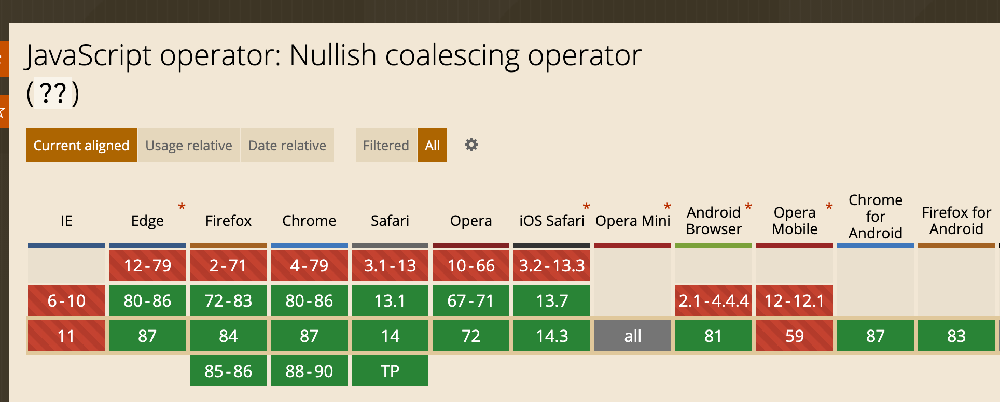

1. 空值合并操作符`??`是一个逻辑操作符，当左侧的操作数为 `null`或者`undefined`时，返回其右侧操作数，否则返回左侧操作数。

   例如：

   ```javascript
   const nullValue = null;
   const emptyText = ""; // 空字符串，也是一个假值
   const someNumber = 42;
   const valA = nullValue ?? "valA 的默认值";
   const valB = emptyText ?? "valB 的默认值";
   const valC = someNumber ?? 0; 
   console.log(valA); // "valA 的默认值"
   console.log(valB); // "" (空字符串虽然是假值，但不是 null 或者 undefined)
   console.log(valC); // 42
   ```

2. 与逻辑或操作符`||`不同，逻辑或操作符会在左侧操作数为[假值](https://developer.mozilla.org/zh-CN/docs/Glossary/Falsy)时返回右侧操作数
   ```javascript
   let count = 0;
   let text = "";
   console.log(count || 42); // 42
   console.log(count ?? 42); // 0
   console.log(text || 'hi'); // "hi!"
   ```

3. 使用逻辑或来赋值一般不会出现问题，但比较特殊的就是数字零，零也是一种假值，所以如果我们非常明确我们就是要在左侧为null或者是undefined的时候赋默认值，那么使用空值合并运算符会更加安全 

4. 空值合并运算符与或运算符等一起使用时的运算优先级还暂未定义，所有目前使用时要注意不要与其他运算符连用

   ```javascript
   null || undefined ?? "foo";   // 抛出 SyntaxError
   true || undefined ?? "foo";  // 抛出 SyntaxError
   ```

5. 空值合并运算符具有和或运算符等一样的短路特性

6. 浏览器兼容性
   
   
   
   目前来说这个特性还比较新，iOS上的safari从13.7才开始支持
