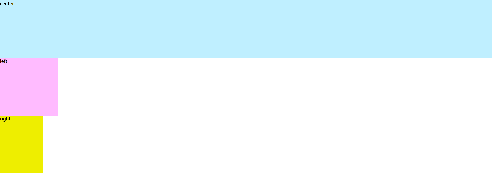
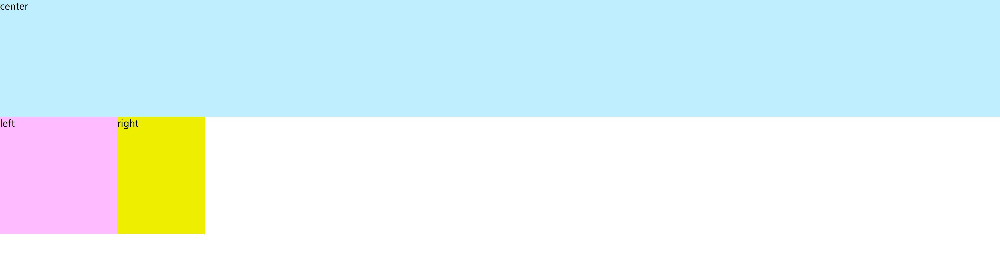
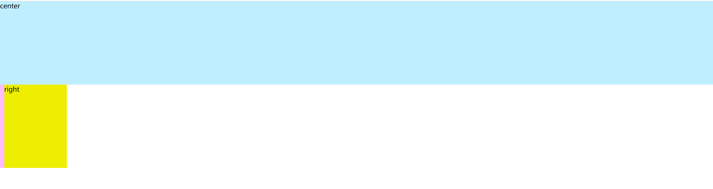
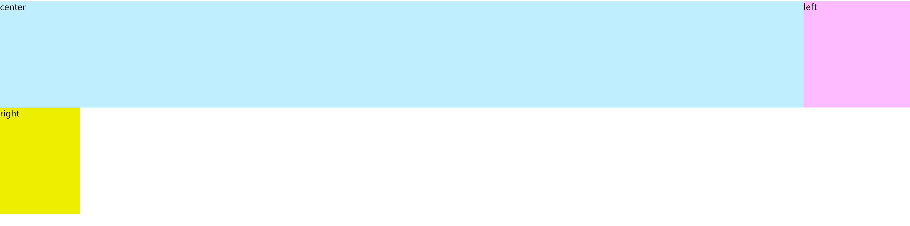
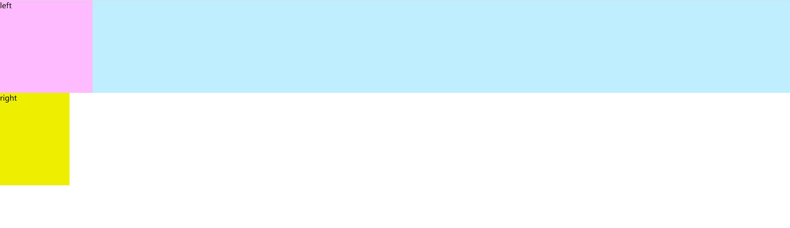
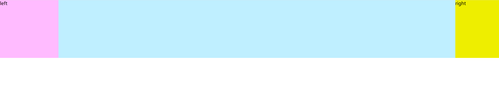
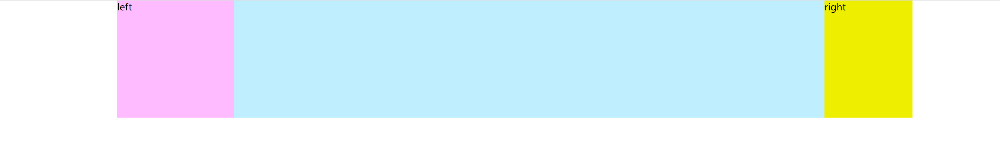
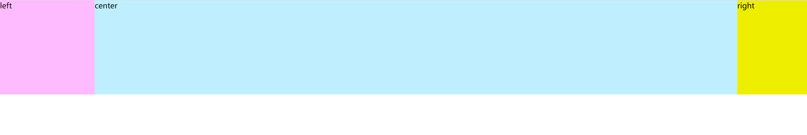

要点：
1. 左中右三栏布局
2. 中间的元素先渲染(SEO相关等需求)

### 准备
首先书写基本结构
```html
<!DOCTYPE html>
<html>
<head>
  <meta charset="utf-8">
  <title>三栏布局——圣杯布局</title>
  <style>
    * {
      margin: 0;
      padding: 0;
    }
    body {
      min-width: 550px;
    }
    .container {

    }
    .column {

    }
    .left {
      width: 200px;
      background: #ffbbff;
    }
    .center {
      width: 100%;
      background: #bfefff;
    }
    .right {
      width: 150px;
      background: #eeee00;
    }
  </style>
</head>
<body>
<div class="container">
  <div class="column center">center</div>
  <div class="column left">left</div>
  <div class="column right">right</div>
</div>
</body>
</html>
```
`center`部分一定要写在最前面(使用这种布局的主要价值)

效果如图：

符合预期，三个块级盒子各占一行，自上而下排布

### 加入浮动
三个盒子都加入浮动
```css
.column {
  min-height: 200px;
  float: left;
}
```

效果如图：


三个盒子顺序放置(浮动的特性)，但由于第一个盒子的`width`设置为了`100%`, 所以独自占了一行

### 移动左盒子(重点)
要点：
1. `margin-left`表示距离兄弟盒子的右边框的距离，正值会远离，负值会靠近，且为负值时，为缩小元素本身的大小
2. `margin-left`为百分比时参考的是父元素的宽度

先看下设置`left`盒子的`margin-left`为`-190px`时的效果：

`left`盒子被移动到了屏幕外面

设置为`-200px`(刚好自身宽度时)：


这里为什么会换行到上一行呢？这是因为`margin`负值应用在`float`元素上时效果有不同
可参考的原文如下:
>- If a negative margin is applied opposite a float, it creates a void leading to the overlapping of content. 

>- If both elements are floated left and margin-right:-20px is applied to #mydiv1, #mydiv2 treats #mydiv1 as if it were 20px smaller in width than it actually is (thus, overlapping it). What’s interesting is that the contents of #mydiv1 don’t react at all and continue to retain its current width.

>- If the negative margin is equal to the actual width, then it overlaps it entirely. This is because margins, padding, borders, and width add up to the total width of an element. So if a negative margin is equal to the rest of the dimensions then the element’s width effectively becomes 0px.

当负值小于自身宽度时，元素会收缩，视图上大小缩小，但是width(开发者工具中看到的width)仍然为原始大小，看上去很像元素在向左移动，**实际上并不是！**

当负值正好等于自身大小时，又不同了。因为元素的计算宽度等于`margin` + `padding` + `border` + `content`， 此处`width = 200px`且无`padding`和`border`, 可以认为元素的计算宽度就是`200px + margin`，
而`margin = -200px`， 根据上面的公式计算，计算宽度正好为`0`!。

我们再来思考，为什么一开始`left`元素就在第二行？是因为`content`元素`width = 100%`，占满了第一行，导致没有空间放下第二个元素，所以`left`不得不换行。
但此时不同了，`left`的计算宽度为`0`(实际渲染大小不变)，可以不用换行，于是浏览器就把`left`盒子放到了第一行渲染。


设置`left`的`margin-left`为`-100%`
```css
.left {
  width: 200px;
  background: #ffbbff;
  margin-left: -100%;
}
```


可以看到刚好到达上一行的最左边

同理，移动右盒子，移动刚好自身宽度，到上一行右侧即可
```css
.right {
  width: 150px;
  background: #eeee00;
  margin-left: -150px;
}
```

效果：


### 容器加入左右 padding，让出空间

```css
.container {
  padding-left: 200px;
  padding-right: 150px;
}
```



### 左右盒子相对父定位，填满 padding

```css
.container {
    padding-left: 200px;
    padding-right: 150px;
    position: relative;
}

.left {
    width: 200px;
    background: #ffbbff;
    margin-left: -100%;
    position: relative;
    right: 200px;
}

.right {
    width: 150px;
    background: #eeee00;
    margin-left: -150px;
    position: relative;
    left: 150px;
}
```



至此，一个圣杯布局就完成了，后期如果我能够解答自己的疑惑，我会更新该文章。


### 参考文章
1. [Smashing Magazine](https://www.smashingmagazine.com/2009/07/the-definitive-guide-to-using-negative-margins/)
2. [StackOverflow](https://stackoverflow.com/questions/21671338/negative-margin-with-float-for-two-column-layout)
3. [mixu](http://book.mixu.net/css/3-additional.html)
4. [csdn](https://blog.csdn.net/Night_Nine_Leaves/article/details/79660762)
